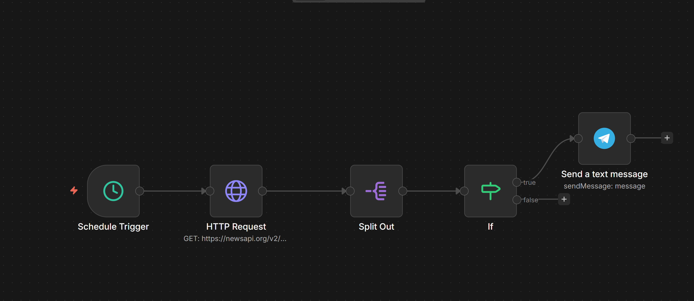

📰 News Automation Workflow (n8n)

📌 Description

This project is an automated news monitoring system built with n8n.
It retrieves the latest news from an external API and sends alerts via Telegram based on specific conditions.

⚙️ Technologies Used

* n8n (workflow automation)
* News API (newsapi.org)
* Telegram Bot

🔄 Workflow Steps

1. Schedule Trigger → runs automatically
2. HTTP Request → fetches latest news
3. Split Out → processes each article
4. IF Node → filters relevant news
5. Send Telegram Message → sends alerts

📸 Workflow Screenshot

🛠️ How to Use

1. Import `workflow.json` into n8n
2. Add your News API key
3. Configure Telegram bot
4. Activate the workflow

👨‍💻 Author

Ziad El Yazidi
